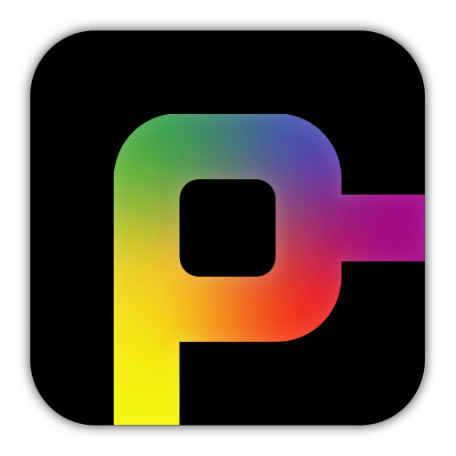

> **A simple and heavily opionated shell for Fish.**

Prompter provides a simple prompt with a colorful design and useful integrations.

 

# TODO

- [ ] Support more shells than Fish
- [ ] Investigate ``fish_right_prompt`` for rendering
- [ ] Make elements modules/modular
